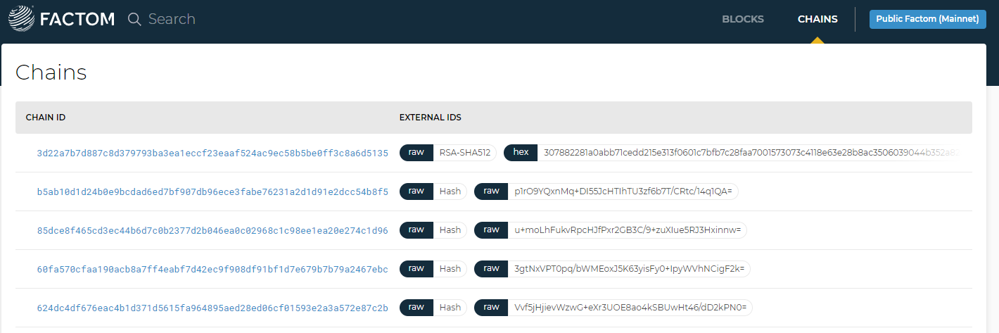

# Overview

The Explorer has two tabs, “_Explorer_” and “_Chains_.” The “_Explorer_” tab displays details of the Factom Data Structures including:

* The Directory Blocks with their IDs and block times
* KeyMRs
* Admin Entries
* EC Entries
* Factoid Entries
* User-generated Entries

The “_Chains_” tab displays details all the Factom chains with their ChainIDs and Chain Names.

**ChainID**

The ChainID is created by hashing the name of a Factom Chain. ChainID’s are used in the Directory Block, and anywhere else in the protocol that must refer to a Factom Chain.

**Chain Names**

Chain Names are generated by the user to uniquely identify a Chain. They can be random numbers, a string of text, a public key, or a hash of some private directory path.

The Chain Name can be specified with multiple sequential byte strings. A [byte string](http://stackoverflow.com/questions/6224052/what-is-the-difference-between-a-string-and-a-byte-string) is similar to a string \(a series of characters\) – but its content is a sequence of bytes instead of characters. They are treated as different segments of data instead of concatenated, to differentiate trailing bytes of one segment from leading bytes of the next segment.

###  

