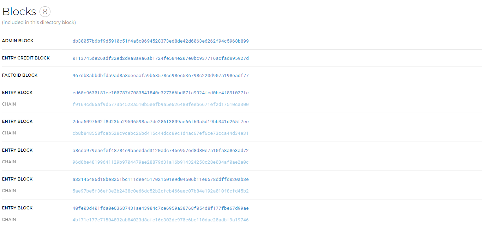
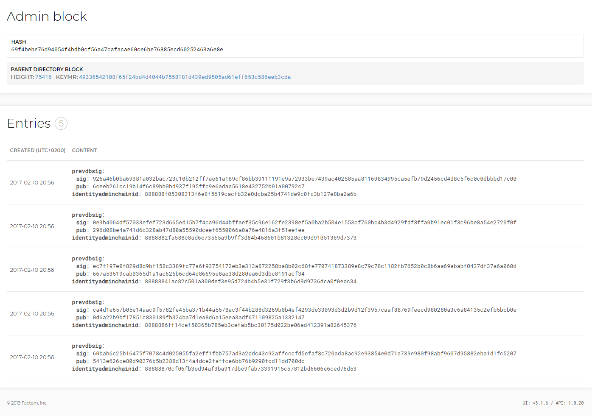
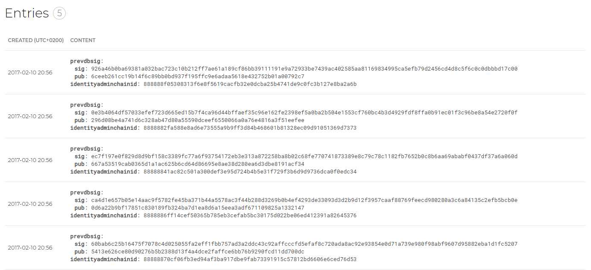
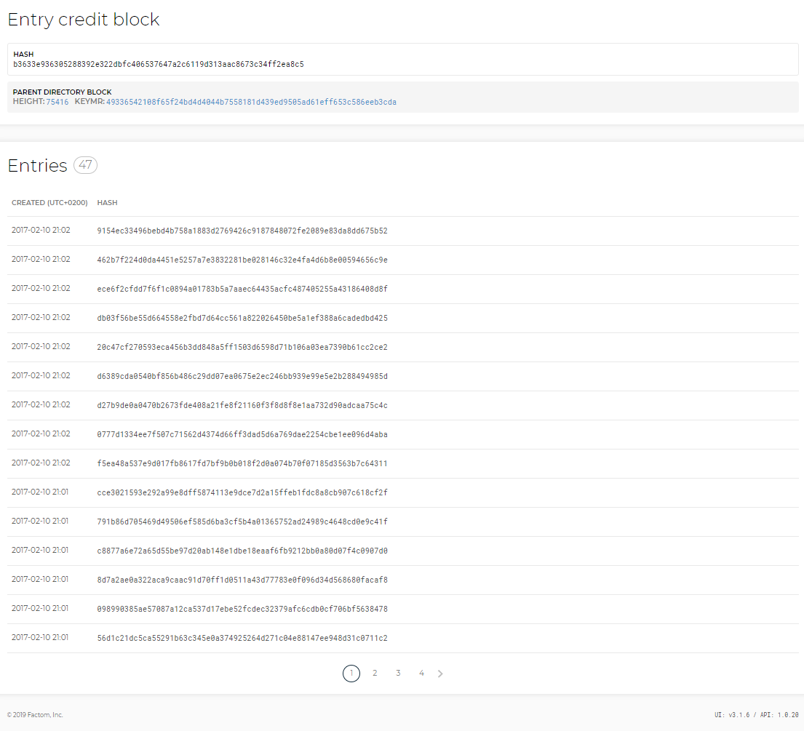
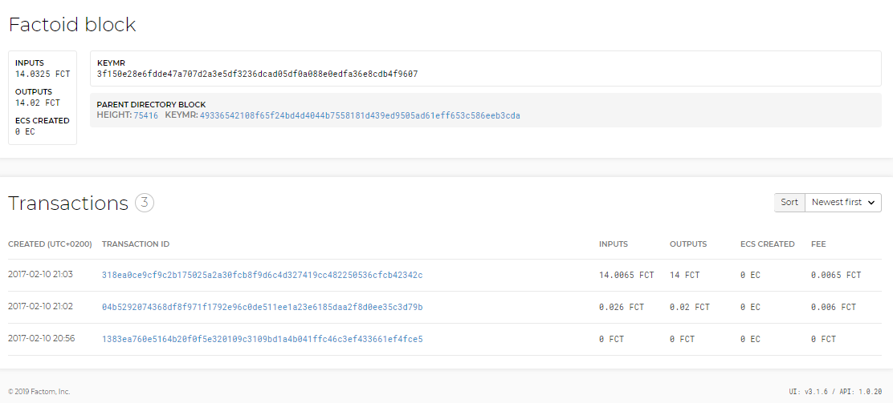
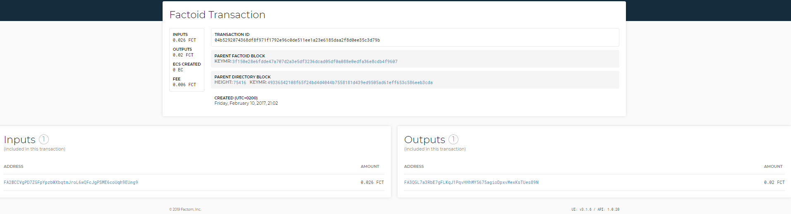
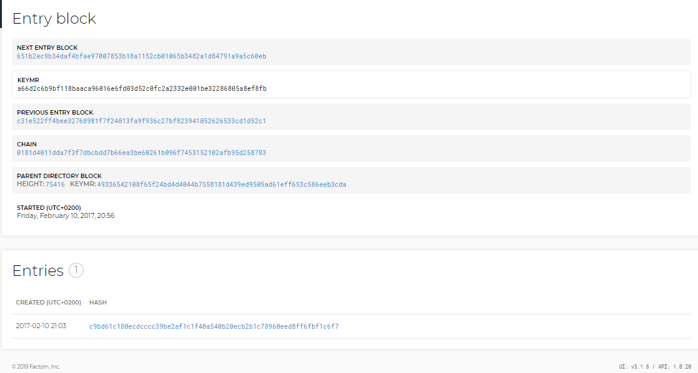
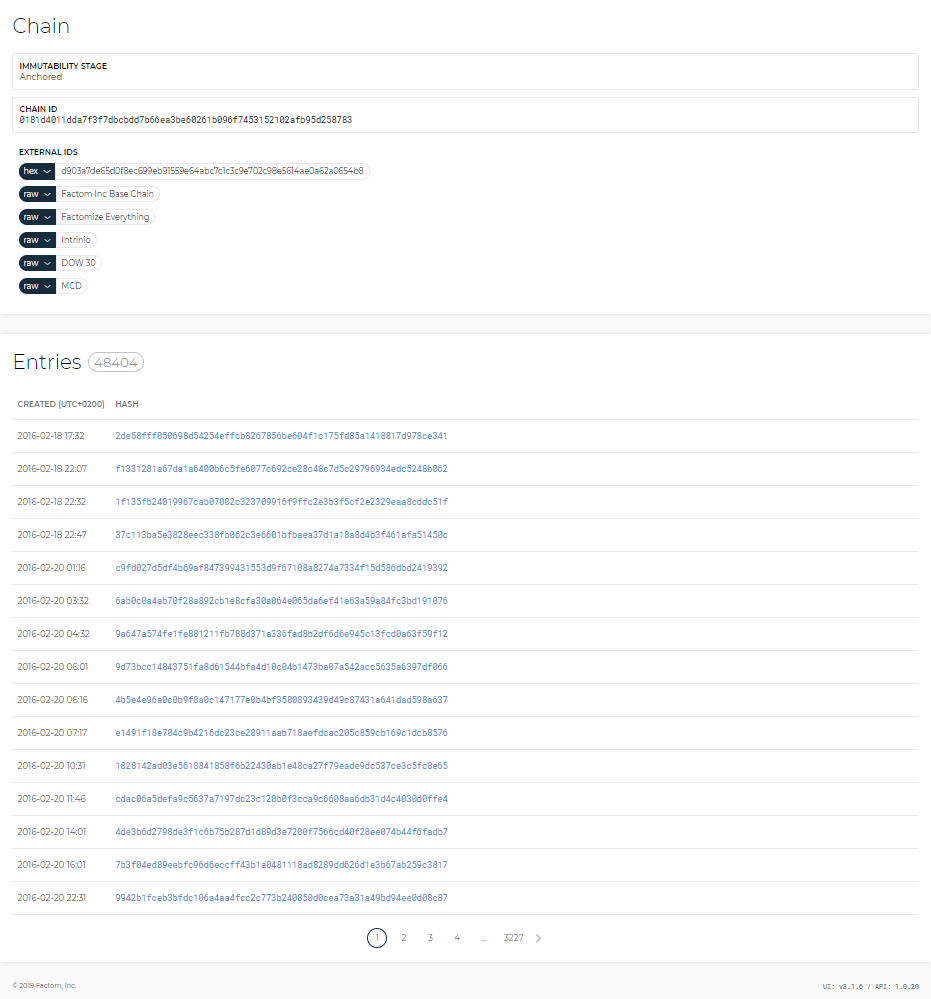
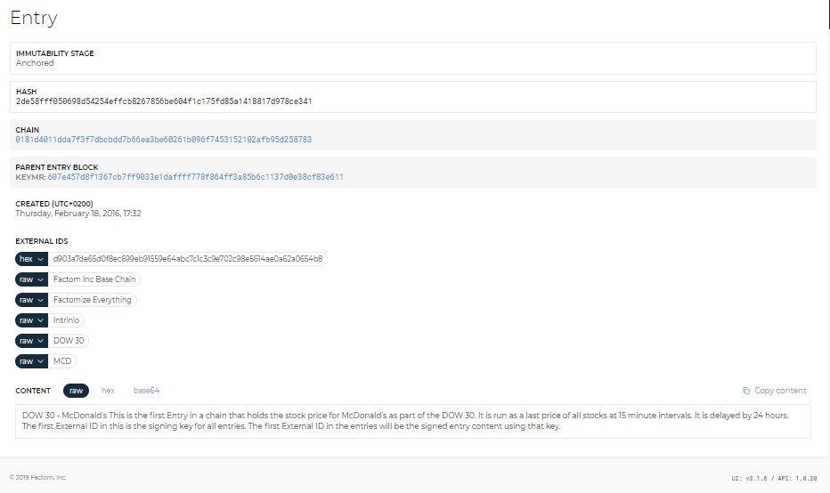
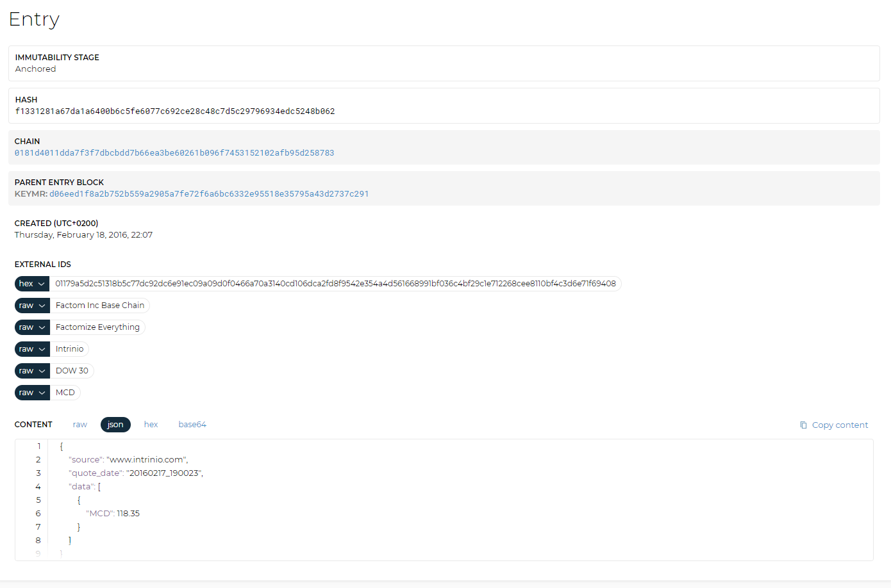

# Block types

## Directory Block

Factom is constructed of a hierarchical set of blocks, with the highest being Directory Blocks, each of which consists of a header and a body. Each Directory Block has a header for unique identification and contains hashes of the Entry Blocks and their respective ChainIDs for entries made during the time period. To link this data together, each Directory Block contains the serial hash of the previous Directory Block. The body of the Directory Block is a series of pairs of ChainIDs and Entry Block Merkle Roots.

In the example below [Directory Block ID 70405](http://explorer.factom.org/dblock/2c6c6247ae2602a08d5b59850682a60228bbc23ae66c67916836b684fc8daea9) shows that factomd has anchored the block on the Bitcoin blockchain.


Note about timestamps: Unlike Bitcoin, timestamps in Factom record the opening of a block rather than the closing. The lower level blocks \(not Directory Blocks\) have minute markers to indicate the number of minutes after opening that each Entry was seen.



Click on the “[BTC Transaction](https://blockchain.info/tx/83ea4629b0e5d7ae7ee313d377dc4f9cb258652c76937afce4d0be29add6d8a3)” and the “[Anchor entry](http://explorer.factom.org/entry/e47fe17ea16474444d3895d6048b2ade4c71114f9742d31a6e1d7d035019e2ee)” to get further information.


Within each Directory Block is an:

* Admin Block
* Entry Credit Block
* A Factoid Block
* Several Entry Blocks

These Factom data structures include different information and are described below.

## Admin Block

The Admin Block contains the signatures and organizational data needed to validate previous and future Directory Blocks. It has a LookupHash, in this case:

[69f4bebe76d94054f4bdb0cf56a47cafacae60ce6be76885ecd60252463a6e8e](http://explorer.factom.org/ablock/69f4bebe76d94054f4bdb0cf56a47cafacae60ce6be76885ecd60252463a6e8e)

This is a SHA256 of the entire block. Clicking it displays the Admin Block itself which contains:

* Full Hash represent the “BackReferenceHash” or LookupHash.
* KEYMR of the directory block
* This particular example includes five entries
* The JSON Data

The JSON Data includes the references to the previous block such as:

* The Previous Block Back Reference Hash: _\“PrevBackRefHash\”:\“53ae4325e045d48f4f786ef9be6065da68c7aa8f149b781d57c2c3ea52fc8c5f\”_
* The current Directory Block Height: _\“DBHeight\”:75416_
* And more info about the current block such as size, entries, messages, etc

The LookupHash for the current Admin Block, 75416, will be included in the next created Admin Block as the Previous Block Back Reference \(PrevBackRefHash\) shortly \(in about 10 minutes\) where it gets referenced. The next Admin Block will also include the same type of data; this creates the Factom Blockchain composed of consecutive blocks with references to previous blocks.

You can reference each Admin Block in two ways:   
  
1. By the Directory Block  
2. By the next Admin Block   
  
Keeping the Admin Blocks secure is critical to the integrity of the Factom Blockchain. However, since there aren’t any Key Merkle Roots and the blocks use straight hashing rather than a slower function that would make brute force attacks more difficult, we had to get creative.   
  
We decided to have two hashes of each Admin Block, both with 256 bits.

* **Hash 1:** A SHA256 hash of the block.
* **Hash 2:** A SHA512 hash of the previous Admin Block in which we only take the top 256 Bits.

This way, if someone wanted to fake an Admin Block while having the hashes match, they would need to break both a SHA256 and a SHA512 at the same time for the same fake data. Eat that, hackers!

The five entries included in this [Admin Block](http://explorer.factom.org/ablock/69f4bebe76d94054f4bdb0cf56a47cafacae60ce6be76885ecd60252463a6e8e) present more information.

Clicking on [any of the entries](http://explorer.factom.org/entry/21d21a9632b9715b607c96fddf9f56bc9f77f7e0839b8c218e0c69ae82272415) shows further data such as the Hash, ChainID, Timestamp, Entry Data and JSON Data.

An Entry is a single data submission made by a user. A collection of entries makes up a Factom Chain. There are certain bookkeeping entries required, but there are no restrictions on the content of an Entry. An Entry is restricted to no more than 10K in size and requires an Entry Credit for every 1K of data. Entry size is so restricted to ensure reasonably fast propagation of Entries through the network, as required by the consensus algorithm. The user can string together multiple entries for larger content.

## Entry Credit Block

An Entry Credit \(EC\) Block is a data structure which packages Chain Commits, Entry Commits, and EC balance increases over a ten-minute period. The Entries are ordered in the Entry Block in the order that they were received by each Federated server. All the Federated servers contribute to the building of the EC Block.

The [Entry Credit Block](http://explorer.factom.org/ecblock/b3633e936305288392e322dbfc406537647a2c6119d313aac8673c34ff2ea8c5) consists of a header and a body. The body is composed of primarily commits and balance increases with minute markers and server markers distributed throughout the body.

This particular block contains 47 Entries.

## Factoid Block

[Factoid Blocks](http://explorer.factom.org/fblock/3f150e28e6fdde47a707d2a3e5df3236dcad05df0a088e0edfa36e8cdb4f9607) package Factoid transactions that take place each minute over a ten-minute period. Factoid transactions and their minute markers are arranged in the order in which they were received by the Federated server. Factoid transactions begin with a version number above zero, differentiating them from other types of transactions, and minute markers are included in the ledger Merkle roots.

In the list of transactions shown in the image above, FCT transactions may be identified by looking at the inputs and outouts.

Selecting the [second entry](http://explorer.factom.org/tx/04b5292074368df8f971f1792e96c0de511ee1a23e6185daa2f8d0ee35c3d79b), more information is displayed about the FCT transaction such as the transaction ID, Timestamp, the Block Height, as well as its FCT Inputs and Outputs.

## Entry Block

[Entry Blocks](http://explorer.factom.org/eblock/a66d2c6b9bf118baaca96016e6fd03d52c0fc2a2332e001be32286805a8ef8fb) package Entry Hashes of all entries for a particular Factom Chain received over a ten-minute period, arranged in the order in which they were received by the Federated server.

After each ten-minute period, the Merkle Roots for each Entry Block are stored in the Directory Block. Entry Blocks contain Entry Hashes with ten one-minute markers.

Entry Data can be viewed by selecting [an entry](http://explorer.factom.org/entry/c9bd61c180ecdcccc39be2af1c1f40a540b20ecb2b1c78960eed8ff6fbf1c6f7) in this Entry Block.

Selecting the Chain ID redirects to the [First Entry display](http://explorer.factom.org/chain/0181d4011dda7f3f7dbcbdd7b66ea3be60261b096f7453152102afb95d258783), showing the Chain that the entry was made to and a series of user-populated External Ids.

In this example, a Chain was created to track the [DOW 30 stock price for McDonald’s](http://explorer.factom.org/chain/0181d4011dda7f3f7dbcbdd7b66ea3be60261b096f7453152102afb95d258783), data provided by Intrinio.

Selecting the [first entry](http://explorer.factom.org/entry/2de58fff050698d54254effcb8267856be604f1c175fd85a1418817d978ce341) shows the Entry Data.

Selecting the [second entry](http://explorer.factom.org/entry/f1331281a67da1a6400b6c5fe6077c692ce28c48c7d5c29796934edc5248b062) shows more data and info about its source such as the website, the stock quote date and the quote itself.

###  

