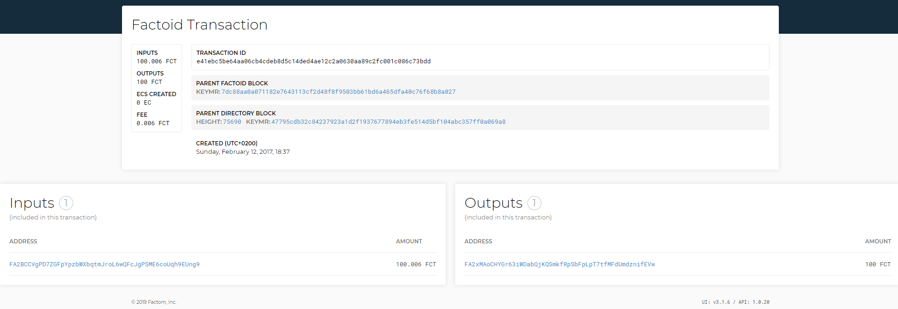
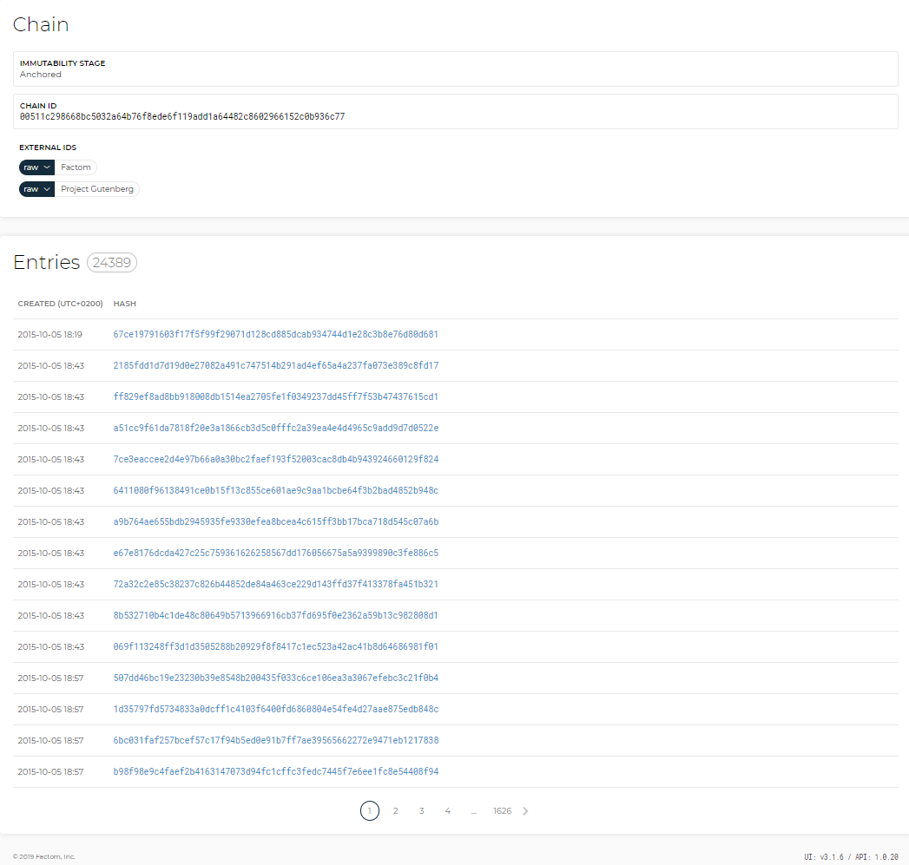
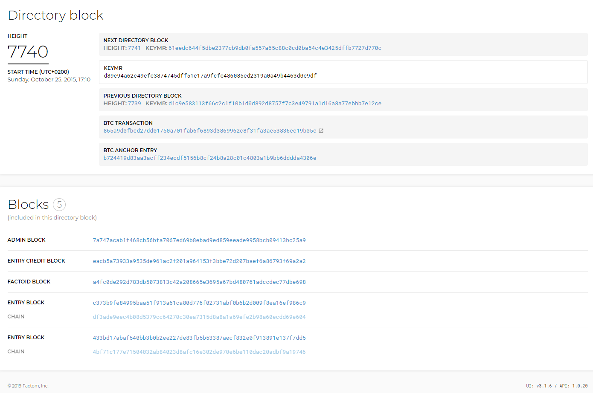

# Usage

### Search for FCT/EC addresses 

To use Explorer to verify balances, copy and paste the FA address you wish to verify into the search bar and hit Enter.

The explorer displays the balance for the FA address, in this example 1.892 FCT, along with previous transactions.

Similarly, to verify the balance of an EC address, copy and paste the EC address you wish to verify in the search bar and hit Enter.

Explorer displays the balance for the EC address, in this example 3999 EC, along with previous transactions.

### Search for a Transaction ID 

When sending FCT to a third party or exchange, the transaction ID is the proof that the transaction took place and that it is unique. It is important to note and keep them for your records. To search for transaction IDs, copy and paste it into the search bar and hit Enter.

Explorer displays [details of the transaction](http://explorer.factom.org/tx/e41ebc5be64aa06cb4cdeb8d5c14ded4ae12c2a0630aa89c2fc001c086c73bdd) such as the time it was made and Inputs and Outputs. This example shows that 100 FTC were sent from the input address to the output address, with a transaction fee of 0.006 FCT debited to the sender.

### Search for a Factom Chain 

Once a Factom chain is created, Explorer can provide an overview of the chain and the entries made to it. The example below shows the [Gutenberg Chain](http://explorer.factom.org/chain/00511c298668bc5032a64b76f8ede6f119add1a64482c8602966152c0b936c77), containing a few thousand entries. The Chain ID is entered into the search bar.

Explorer returns the Project Gutenberg Chain with all its entries.

### Search for a Block ID 

Specific blocks can be pulled up by entering the Block ID \(also known as Block Height\) into the search bar. The example below shows [block 7740](http://explorer.factom.org/dblock/d89e94a62c49efe3874745dff51e17a9fcfe486085ed2319a0a49b4463d0e9df).

After hitting Enter, the Explorer will find the block and present its information.  

Searching for a block is very useful particularly to look for a Block ID that was created sometime in the past, by searching for a Block Height you can go back in time in Factom very rapidly.


You are now equipped to use Factom Explorer to search the Factom Blockchain.


