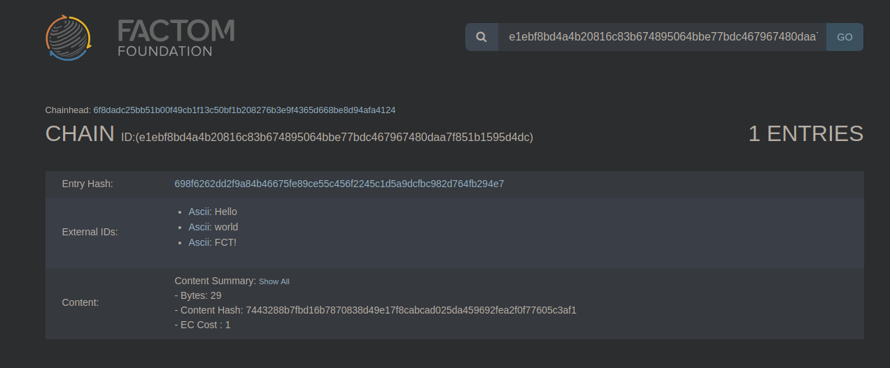
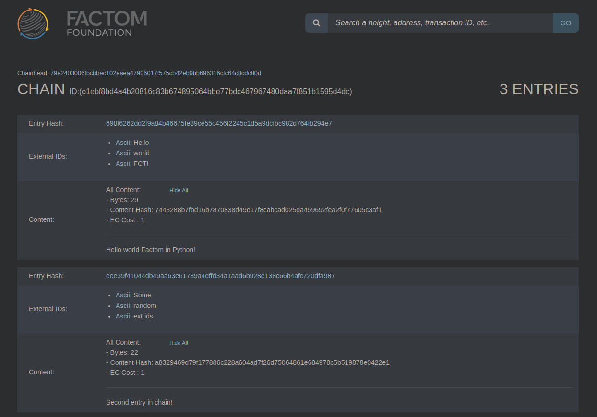

# Python

In this tutorial we will be using the Factom [Python library](https://github.com/TRGG3R/factom-api) to interact with the `factomd` and `factom-walletd` APIs in order to  secure some data on the Factom blockchain, also known as _factomizing_. This tutorial is using Python 3.6.7 that comes with a fresh Ubuntu 18.04 install, but versions 3.4, 3.5, 3.7 most likely work as well.

## _Requirements_

* _Python 3+_
* _Git_

## Setup

### Setting up the Factom sandbox

For development it is recommended to run a local installation of `factomd` and `factom-walletd`, there are a few reasons for this:

* No need to spend money on Entry Credits
* Getting slightly familiar with how a Factom node works.
* Set your own block time, default for mainnet is 600 seconds \(10 minutes pr. block\)

With that said, if you don't have a Factom sandbox setup, head over to the [Developer Sandbox Setup Guide](https://developers.factomprotocol.org/start/developer-sandbox-setup-guide) and follow one of the three setup methods.  

### Setting up the Python environment

A good idea is to create a Python virtual environment to keep your Python packages isolated to your project. This will avoid any package version conflicts between different Python projects on your computer. First, make a directory containing your virtual environments, or navigate to it if you already have one.

```bash
mkdir ~/venvs
cd ~/venvs
```

Now create the project specific virtual environment:

```bash
python3 -m venv hello-world-fct
```

This will create a new directory in your current folder, named whatever you specified in the command. Here we named the virtual environment "_hello-world-fct_", you can change this to a different name that suits you. If the command fails to run, follow the instructions given in the command line and try again. Now activate the environment:

```bash
source hello-world-fct/bin/activate
```


Your environment is now active and we can move on to installing the Python package\(s\)!


### Installing the Python package\(s\)

We will be using the [Factom API Python client library](https://github.com/TRGG3R/factom-api). Install it via pip:

```bash
pip install git+https://github.com/TRGG3R/factom-api.git
```


That's it! Lets start writing some code!


## Usage

Everything is setup and ready now. All you need is your favorite IDE and make sure you select / activate the Python interpreter you setup earlier.

### Initiating Factomd and FactomWalletd instances



```python
from factom import Factomd, FactomWalletd

FCT_ADDR = 'YOUR_FCT_ADDRESS'
EC_ADDR = 'YOUR_GENERATED_EC_ADDRESS'

# Initiate walletd and factomd instances
walletd = FactomWalletd()
factomd = Factomd(
                host='http://localhost:8088',
                fct_address=FCT_ADDR,
                ec_address=EC_ADDR,
                username='hello',
                password='world')
```



### Retrieving wallet balances using factomd

Let’s check the wallet balances on both the FCT and EC addresses we imported and generated earlier. The FCT balance will be shown in Factoshis\( Factoids \* 10^-8\) :



```python
# Retrieve FCT and EC balance
fct_balance = factomd.factoid_balance(FCT_ADDR)
ec_balance = factomd.entry_credit_balance(EC_ADDR)

print(fct_balance)
print(ec_balance)
```



If you provided your wallet info when initiating the `factomd` instance you can run the above lines without providing the addresses:



```python
# Retrieve FCT and EC balance
fct_balance = factomd.factoid_balance()
ec_balance = factomd.entry_credit_balance()

print(fct_balance)
print(ec_balance)
```



You should see the following results:

```python
{'balance': 2000000000000}  # 2000000000000 Factoshis
{'balance': 0}
```

At the moment we have 20000 Factoids and 0 Entry Credits. We need to fund our Entry Credit address by purchasing some Entry Credits, as those are required in order to record data on-chain.

### Purchasing Entry Credits using the imported Factoid address

The wallet daemon provides a method `fct_to_ec()` to burn Factoids and mint Entry Credits. We will use that method, but first we need to know what the Factoid to Entry Credit exchange rate is:



```python
# Check the EC rate
ec_rate = factomd.entry_credit_rate()
print(ec_rate)
```



Result:

```python
{'rate': 1000}
```

This tells us we'll need to burn 1000 Factoshis \(0.00001 FCT\) in exchange for 1 Entry Credit, so let's purchase 10 entry credits for 10000 Factoshis \(0.0001 FCT\). 



```python
# Purchase some EC with Factoids
r = walletd.fct_to_ec(factomd=factomd,
                      amount=10000, 
                      fct_address=fct_address, 
                      ec_address=ec_address)
print(r)
```



Result:

```python
{'message': 'Successfully submitted the transaction', 'txid': 'c60e4fee59876ce5ee242d9da15d4764a2880f36efac8c18bc7306986b041fb5'}
```

The transaction was successfully submitted with `txid`: `c60e4fee59876ce5ee242d9da15d4764a2880f36efac8c18bc7306986b041fb5`. Let's check the balance again on our wallets as shown earlier. The result should be:

```python
{'balance': 1999999978000}
{'balance': 10}
```

Note that the FCT balance has been reduced by 22K instead of 10K Factoshis due to the network transaction fees.


We've successfully funded our Entry Credit Address with 10 Entry Credits. Let's move on to creating chains and entries. 


### Creating chains and entries 

The wallet client has a `new_chain()` method that handles everything needed to create a new chain. To make a new chain you need to provide:

* Your `factomd` instance, where the creation message will be submitted
* A list of external IDs
* Entry content
* Your Entry Credit address



```python
# Create new chain!
new_chain = walletd.new_chain(factomd=factomd,
                              ext_ids=["Hello", "world", "FCT!"],
                              content="Hello world Factom in Python!",
                              ec_address=EC_ADDR)

print(new_chain)
```



 Result:

```python
{'message': 'Entry Reveal Success', 'entryhash': '698f6262dd2f9a84b46675fe89ce55c456f2245c1d5a9dcfbc982d764fb294e7', 'chainid': 'e1ebf8bd4a4b20816c83b674895064bbe77bdc467967480daa7f851b1595d4dc'}
```

Success! Lets head over to the [local Factom explorer](http://localhost:8090/) to see if our entry exists. Search for the `chainid`, found in the result above, in the search box as seen below:




If nothing shows up you might need to wait a few more seconds / minutes, depending on what you set your block time to.


Our chain is successfully created and is visible in the explorer, now lets add some entries to that chain. 



```python
# Chainid retrieved from the previous result
chain_id = 'e1ebf8bd4a4b20816c83b674895064bbe77bdc467967480daa7f851b1595d4dc'

# Add a new entry to existing chain
new_entry = walletd.new_entry(factomd=factomd,
                              chain_id=chain_id,
                              ext_ids=['Some', 'random', 'ext ids'],
                              content='Second entry in chain!',
                              ec_address=EC_ADDR)
print(new_entry)
```



Result:

```python
{'message': 'Entry Reveal Success', 'entryhash': 'eee39f41044db49aa63e61789a4effd34a1aad6b928e138c66b4afc720dfa987', 'chainid': 'e1ebf8bd4a4b20816c83b674895064bbe77bdc467967480daa7f851b1595d4dc'}
```

Success! Let's check the explorer again to see if some new entries show up on the same chain:




As we see in the image above, both the initial entry and new entry exist on the chain! You can also read chains and entries created directly in Python!


### Reading chains and entries created

Sometimes the entries in your chain may reference each other, thus you may want to scan the entire chain in order to very its integrity.  The `factomd` client provides a `read_chain()` method which iterates over all entry-containing blocks and returns a list of entries in reverse order.



```python
chain_id = 'e1ebf8bd4a4b20816c83b674895064bbe77bdc467967480daa7f851b1595d4dc'

# Read the chain
chain_data = factomd.read_chain(chain_id=chain_id)

print(chain_data )
```



Result:

```python
[{'chainid': 'e1ebf8bd4a4b20816c83b674895064bbe77bdc467967480daa7f851b1595d4dc', 'extids': ['Some', 'random', 'ext ids'], 'content': 'Second entry in chain!'}, {'chainid': 'e1ebf8bd4a4b20816c83b674895064bbe77bdc467967480daa7f851b1595d4dc', 'extids': ['Hello', 'world', 'FCT!'], 'content': 'Hello world Factom in Python!'}]
```


Success! The whole chain is returned with all of its entries. The latest entry is returned first. 


### Error handling

The Python library returns a number of different error codes in case of a problem. The API method you tried to call will raise a `factom.exceptions.FactomAPIError` with details about the error.

For example, if we try to create a new chain with the exact same parameters as a previously created chain you’ll see something similar to this:

```python
Traceback (most recent call last):
  File "/hello-world-fct/main.py", line 65, in <module>
    ec_address=EC_ADDR)
  File "/dev/hello-world-fct/lib/python3.6/site-packages/factom/client.py", line 256, in new_chain
    'ecpub': ec_address or self.ec_address
  File "/dev/hello-world-fct/lib/python3.6/site-packages/factom/client.py", line 73, in _request
    handle_error_response(resp)
  File "/dev/hello-world-fct/lib/python3.6/site-packages/factom/exceptions.py", line 19, in handle_error_response
    raise codes[code](message=message, code=code, data=data, response=resp)
factom.exceptions.InvalidParams: -32602: Invalid params
```

Details about the error are attached to the exception instance, thus a good idea is to wrap each API call into try blocks such as:



```python
from factom.exceptions import FactomAPIError

try:
    new_chain = walletd.new_chain(factomd=factomd,
                                  ext_ids=["Hello", "world", "FCT!"],
                                  content="Hello world Factom in Python!",
                                  ec_address=EC_ADDR)
except FactomAPIError as e:
    print(e.data)
```



As this chain already exists, it'll return the following message:

```python
Chain e1ebf8bd4a4b20816c83b674895064bbe77bdc467967480daa7f851b1595d4dc already exists
```

For a full list of the error codes in the library see [here](https://github.com/TRGG3R/factom-api/blob/Incorporate-updated-RPC/factom/exceptions.py).

### Full code

Below is the full code featuring everything mentioned above, with some extra additions. 



```python
from time import sleep

from factom import Factomd, FactomWalletd
from factom.exceptions import FactomAPIError

def wait_for_entry(entryhash):
    """
    Wait for an entry to be recorded on-chain.
    
    This can be detected by making sure that the entry hash is not present
    in the list of pending entries.
    
    :param str entryhash: the hash of the entry to wait for
    :returns: None
    """
    wait = True    
    while wait:
        pending_entries = factomd.pending_entries()
        if not pending_entries:
            wait = False
        else:
            for entry in pending_entries:
                if entryhash == entry['entryhash']:
                    pass
                else:
                    wait = False
        sleep(1)

# Wallets, remember to import the FCT address and generate the EC address.
FCT_ADDR = 'FA2jK2HcLnRdS94dEcU27rF3meoJfpUcZPSinpb7AwQvPRY6RL1Q'
EC_ADDR = 'EC2qpLisdttfe6JHPmQ7DiZqYet2Ga5rzeWAbx2QWSMTMB5G5K4X'

if __name__ == "__main__":
    # Default params
    walletd = FactomWalletd()
    
    # You can also specify fct and ec addresses, change host, or specify RPC credentials, for example:
    factomd = Factomd(host='http://localhost:8088',
                      fct_address=FCT_ADDR,
                      ec_address=EC_ADDR,
                      username='rpc_username',
                      password='rpc_password')
                        
    # Check balance on wallets
    fct_balance = factomd.factoid_balance(FCT_ADDR)
    ec_balance = factomd.entry_credit_balance(EC_ADDR)
    print(f'\n Factoshi (FCT*10^(⁻8)) balance: {fct_balance['balance']}')
    print(f'Entry Credit (EC) balance: {ec_balance['balance']}\n')
    
    # Check entry credit rate
    ec_rate = factomd.entry_credit_rate()
    
    # Print result
    print(f'Entry credit rate is: {ec_rate["rate"]} Factoshis')
    
    # Purchase some entry credits with our imported FCT wallet if our EC balance is less than 20.
    if ec_balance['balance'] < 20:
        print('Balance is less than 20 Entry Credits, purchasing 50 more.')
        fct_to_ec = walletd.fct_to_ec(factomd, 50000, fct_address=FCT_ADDR, ec_address=EC_ADDR)
        
        # Print result
        print(fct_to_ec)
    
    # Wait a little
    print(f'Sleeping for 5 seconds..\n')
    sleep(5)
    
    # Check updated balances
    fct_balance = factomd.factoid_balance(FCT_ADDR)
    ec_balance = factomd.entry_credit_balance(EC_ADDR)
    print(f'Factoshi (FCT*10^(⁻8)) balance: {fct_balance['balance']}')
    print(f'Entry Credit (EC) balance: {ec_balance['balance']}\n')
    
    # Initiate some variables
    new_chain = None
    chain_id = None
    entry_hash = None
    
    try:
        # Create new chain!
        # The cost of creating a new chain is 10 ECs.
        new_chain = walletd.new_chain(factomd=factomd,
                                      ext_ids=['Hello', 'world', 'FCT!'],
                                      content='Hello world Factom in Python!',
                                      ec_address=EC_ADDR)
                                        
        # Store chain ID and entry hash
        chain_id = new_chain['chainid']
        entry_hash = new_chain['entryhash']
        
        # Print result
        print(f'New chain created with chain ID: {chain_id} and entry hash: {entry_hash}')
        
        print('Waiting for the newly created chain to appear on the blockchain')
        # Wait for the new chain to appear on the blockchain
        wait_for_entry(entryhash=entry_hash)
        
    except FactomAPIError as e:
        print(f'{e.data}.\n')
        # If chain already exists retrieve the chainid.
        chain_id = e.data.split()[1]
    
    new_entry = None
    try:    
        # Create a new entry in the chain created above using the chainid
        print(f'Creating a new entry to the chain with chain ID: {chain_id}.')
        new_entry = walletd.new_entry(factomd=factomd,
                                      chain_id=chain_id,
                                      ext_ids=['Some', 'random', 'ext id'],
                                      content='Second entry in chain!',
                                      ec_address=EC_ADDR)
        # Print result
        print(f'{new_entry}\n')
    except FactomAPIError as e:
        print(e.data)
        
    # Read the whole chain including the entries
    chain_data = None
    try:
        print(f'Reading the whole chain:')
        chain_data = factomd.read_chain(chain_id=chain_id)
        
        # Print result
        print(chain_data)
        
    except FactomAPIError as e:    
        print(e.data)
```



## Conclusion

You now have all the tools available and ready to start fully interacting with the Factom blockchain in Python!

## **Troubleshooting**

This section will be filled out once users start reporting issues, problems or relevant questions they might have.

