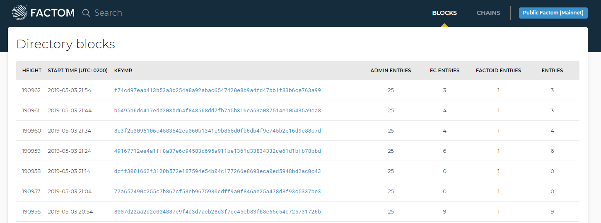
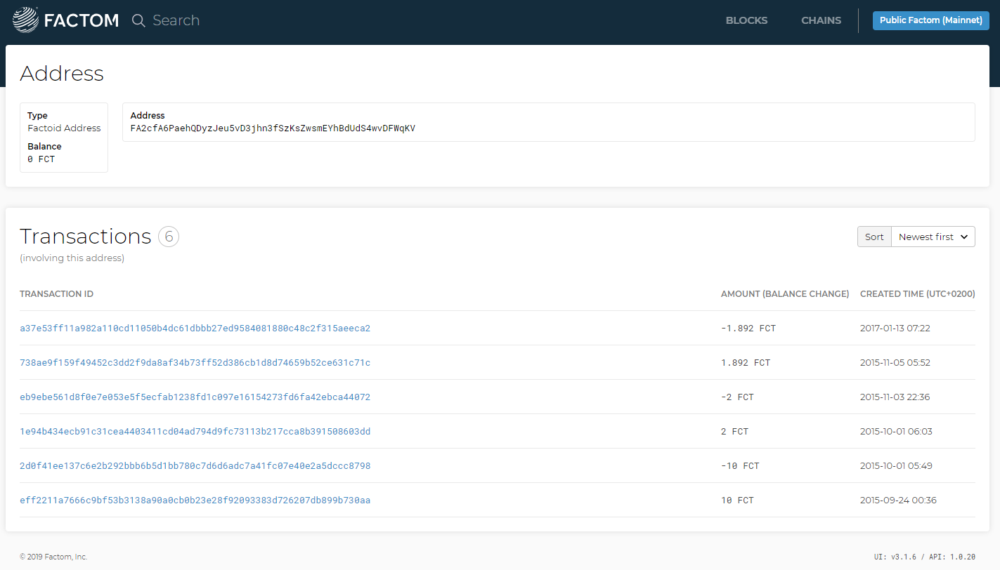
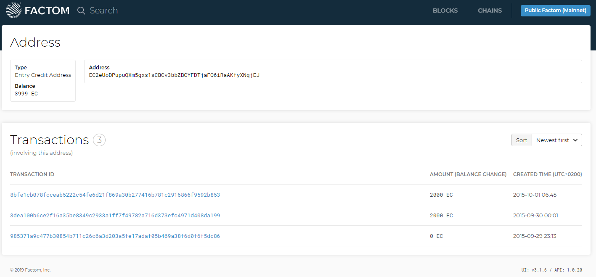

# Run and use the wallet

## Run Enterprise Wallet

_Time to remember Mr. Miyagi’s lesson._

This step will be used every time you need to run Enterprise Wallet, so get familiar with it. Practice makes perfect. Wax on, wax off.

Enterprise Wallet is a desktop app for Mac, Windows, and Linux, which allows you to run a wallet with a graphic user interface \(GUI\). There are two methods to run the wallet, choose the one to suit your needs and skills best. Every time you come across **“Run Wallet”** you need to perform the following steps according to your choice below. These are the basic steps to run the wallet.

**Running Enterprise Wallet Online** means you can point to a remote factomd node and don’t have to worry about using command line, running factomd, or syncing the blockchain. This option is probably best suited for users who simply want to send and receive FCT or buy EC.

**Running Enterprise Wallet Locally** means also having to run factomd locally as well as sync the blockchain which can take a long time and require some command line skills. This option is a bit technical but can turn out to be more reliable as everything runs on your own machine.  
The online wallet option is still experimental, and the hosted factomd node may have reliability issues while we tune things. For production environments, we recommend running your own local wallet and factomd nodes.

### Upgrade Your Old Wallet File

This only applies to users who have previously run Factom Genesis and have an old wallet file. If running Factom for the first time, you can skip this step.

If you have run our previous software release “Factom Genesis \(FG\)” you need to import your FG wallet file \(named _factoid\_wallet\_bolt.db_\) the first time you run the Enterprise Wallet app to make sure all its previous addresses and balances are transferred over. You have learned how to backup your wallet file in our [Backup Your Wallet File!](https://developers.factomprotocol.org/start/enterprise-wallet/run-and-use-the-wallet#backup-wallet-file) guide and you should know if still in the default location within the .factom folder at ~/.factom/factoid\_wallet\_bolt.db.

If your old wallet file is in the default place you don’t need to do anything, the new wallet will recognize the file and import it automatically. You can simply follow the same instructions for who has never used FG below.

If your wallet file is not in the default location, then you need to manually add it to ~/.factom/factoid\_wallet\_bolt.db.

If by any chance the operation fails, quit the wallet, delete the new wallet file located at ~/.factom/wallet/factoid\_wallet.db and launch the wallet again until you get all your addresses back.  
Remember, you only need to do this once the first time you run Enterprise Wallet. After that, you can run it normally.

Once you are happy, continue by following the instructions below to choose your wallet type.

### Choose Your Wallet Type

When you launch Enterprise Wallet you have the option to choose a “secure” or a “not secure” wallet, the former is encrypted the latter is unencrypted.

Each option maintains a different wallet file. This means you can have both a non-secure and a secure wallet.

To open either one, just close and relaunch EnterpriseWallet, selecting the one you wish to open.

#### **Secure Wallet**

To create a Secure Wallet simply click on the Secure Wallet button.

You will then need to enter a strong password for your wallet, tick the box next to “I acknowledge that if I lose this password and my seed I will lose access to the wallet and its funds,” and finally click the “Proceed to Encrypted Wallet” button to access the Secure Wallet.

This will automatically generate a new “factom\_wallet\_encrypted.db” file in your .factom folder \(which will be encrypted with the password you just chose\). You will need the same password every time you want to access your Secure Wallet, make sure to write it down and keep it safe.

  
Opening a secure wallet will encrypt all private keys and the seed. Keep in mind this means that if you forget your password and seed, there is no recovery option. Be careful selecting this option, When using an encrypted wallet, be sure to immediately [back up your seed](https://developers.factomprotocol.org/start/enterprise-wallet/run-and-use-the-wallet#backing-up-your-wallet-seed). This allows you to regenerate your wallet if you lose the password or the database gets corrupted. This option will not convert a v1 wallet if found on disk. This is intentional, as converting any wallet to an encrypted wallet means the original wallet still exists, and still insecure. Addresses and seeds can still be imported/exported using the settings and address book tabs.

Once you are happy, continue by following the instructions below for either the Online or Local Enterprise Wallet setup.

#### **Not Secure Wallet**

To create a Not Secure Wallet simply click on the Not Secure button.

Make sure to tick the box next to “I acknowledge that my private keys will not be encrypted and are thus unprotected,” and finally click the “Proceed to Unencrypted Wallet” button to access the Secure Wallet.

  
A non-secure wallet does not use encryption, and therefore it can be accessed by other users on your machine or malware. This will leave your private keys exposed and unencrypted on your hard drive. Choose your options carefully and be sure to immediately [back up your seed](https://developers.factomprotocol.org/start/enterprise-wallet/run-and-use-the-wallet#backing-up-your-wallet-seed). 


We strongly recommend everyone to use the secure option.


Learn how to transfer FCT from a Not Secure wallet to a Secure one by following our guide [here](https://developers.factomprotocol.org/start/enterprise-wallet#transfer-fct-to-secure-wallet).

Once you are happy, continue by following the instructions below for either the Online or Local Enterprise Wallet setup.

### Run Enterprise Wallet Online

On Windows, Mac and Linux locate the Enterprise Wallet app and launch it.

At first launch, it may show an error message under the “Transactions Tab.”

The first thing to do is to change the factomd node the wallet is pointing to. Go to “Settings.” By default, the wallet uses the local factomd instance at localhost:8088, hence why there was an error.

Now click “Custom Factomd Location” and enter in a valid factomd instance. Use: courtesy-node.factom.com \(copy and paste the address in the text field\).

Then click “Save Changes.”


You are now using an online version of factomd! No need to sync the whole blockchain, just the transactions.


If this is the first time you are running the wallet, now’s a great time for a cup of tea! The wallet needs to catch up on transactions and may take some time while displaying “syncing transactions,” however it doesn’t take too long, just about the time to prepare and drink your tea.

Once the wallet has synced all transactions, it should look like below.

The first thing you may want to do is change the wallet theme, for the purposes of this guide, we will use the Dark Theme going forward.

Click on “Settings” on the bottom left and select “Enable dark theme,” then hit “SAVE CHANGES.”

Here’s how it will look like in dark.

Pat yourself on the back for making it this far! You have now run Enterprise Wallet for the first time and managed to change its theme.  

There are other advanced features shown on the settings page, and we will tell you more about them as we go along with our guides. For the time being, we will use the wallet with default settings.

### Run Enterprise Wallet Locally

For Mac and Windows, use the `cd` command with Terminal to browse to the location of your FF installation. On Linux, you will be able to run commands without having to browse the to install location.

This step is required before you run factomd. In a new Terminal window, run:

#### **Mac**

`cd /Applications/Factom/`

#### **Windows**

`cd C:\Program Files (x86)\Factom\`

On Mac, Windows and Linux, run “factomd” first

`factomd`

Then browse to [http://localhost:8090](http://localhost:8090/) to see the Control Panel for your local FF node.

  

If this is the first time you are running FF, now’s a great time to check your Facebook feed or take your dog on a walk. Syncing the Factom blockchain may take a little while, the blockchain is …big. The Control Panel will display the progress and notify you when it has finished syncing. This will also occur when it has been a while since the last time you have run factomd. However, after the first full sync is complete, successive syncs are faster. You will only have to sync blocks since the last full sync. 

On Windows, Mac and Linux locate the Enterprise Wallet app and launch it.

The wallet may show a warning while your factomd instance is syncing the blockchain.

If this is the first time you are running the wallet, now’s a great time for a cup of tea! The wallet needs to catch up on transactions and may take some time while displaying “syncing transactions,” however it doesn’t take too long, just about the time to prepare and drink your tea.

Once the wallet has synced all transactions, it should look like below.

The first thing you may want to do is change the wallet theme. For the purpose of this guide, we will use the Dark Theme going forward. Click on “Settings” on the bottom left and select “Enable dark theme,” then hit “SAVE CHANGES.”

Here’s how it will look like in dark.

Pat yourself on the back for making it this far! You have now run Enterprise Wallet for the first time and you managed to change its theme.

  
There are other advanced features shown on the settings page, and we will tell you more about them as we go along with our guides. For the time being, we will use the wallet with default settings.

## Backup Your Wallets

When you first load up your enterprise wallet, you’ll probably notice a message on the sidebar prompting you to back up your wallet. This is a way to maintain access to your factoids in case something happens to your Enterprise Wallet installation or your machine. We highly recommend backing up your wallets in a secure location. But hey, what do we know…. we only built it.

### Backing Up Your Wallet Seed

Addresses that you generate using the enterprise wallet are going to be based on a common seed. This seed is the most private of private keys. Anyone who has it can regenerate and claim all of the addresses that are spawned by it one by one. This means that it’s a good idea to keep this seed around, but it’s also smart to make sure that no one else can gain access to it. We’ll give you a quick guide on how to get the seed for your wallet, but be sure to only go through these steps in a place where you can have some privacy.

To begin, select the Backup button on the sidebar. If you have some addresses that originate from another seed, you’ll see a warning about those addresses first. The seed you’re about to view does not cover these public keys… You won’t be able to recreate them with your back up. On the main screen, this is notated by these addresses not having a filled star next to them. We’ll deal with external addresses [below](https://docs.factom.com/#external_addresses)… For now, just know that you’ll have to back these up separately. Alternatively, you can move any Factoids held by these addresses into addresses based on your current seed.

#### Viewing your Seed Phrase

On the next page, you’ll see a message reminding you once again to be sure that you’re in a safe location. That guy standing behind you right now? Pretending to be disinterested? He can totally steal your factoids if he wants to. Don’t give him a chance! Move to another room or shoo him away.

Once you’ve dealt with the factoid vampires, you can safely view the next screen. You’ll see the twelve words that make up your seed phrase along with their proper order. You’ll want to write \(not type!\) these words down on a piece of paper you can place in a secure location. For good measure, you can keep this article, which will probably begin to glow faintly with secrets, in a safe or safety deposit box. For bonus points, you can use a cipher to obscure the actual words in your key phrase in case someone does get to the paper. For double bonus points, you can even forgo the paper altogether and commit the phrase to memory.

Whatever you do, just remember that if you lose access to or forget the key phrase, you won’t be able to recreate your wallet. That defeats the purpose of this guide and, thus, is not recommended.

#### Verify Your Seed Phrase

Finally, you’ll be asked to verify your seed phrase. This gives you a chance to make sure you’ve properly recorded your seed phrase. If you can complete this step, you will have officially backed up your Factom Wallet. Congrats!

### Restore a Seed

Restoring your backed up wallet is just a matter of plugging in your seed phrases. To recall a wallet using this method, you’ll need to make your way to the settings page. You can do this by clicking the button on the sidebar.

Next, scroll down to the bottom of the page until you see “Restore a Seed”. You can click the orange button to proceed from here.

Then, enter the seed phrases of the wallet you want to restore. If done properly, your seed will change to the one you have entered. However, if you go to the Address book, you may notice something… Not much has changed. While your addresses no longer have filled white stars next to them, the addresses themselves will be exactly as you left them. What gives?

Well, changing the seed doesn’t actually pull your addresses back automatically. It simply gives you the mathematical base that you need to recreate those addresses. As you create new addresses based on the seed, you’ll be recreating the addresses from your previous wallet. That means you have the private keys and access to the balances of those addresses as well. So to fully recreate your wallet, you need to repopulate your address book with those lost addresses. If you had five before, you’d get those same five addresses when you repopulate. And, of course, any addresses you had before you restored the new seed will still be there for you to use.

### External Addresses

As mentioned earlier, a backup of your Seed Phrases will not allow you to recreate addresses that are not based on that same seed. These are called external addresses and are marked by the open star that sits next to their entry in the address book.

#### How do I recover External Addresses?

The simple way: if you have any balances on addresses not generated from your wallet seed, you may want to transfer them to an address generated from your seed.

**The easy way**: keep a backup of your wallet file, whatever addresses are in there will always be, no need to recover them.

**The alternative way**: make sure to keep your external addresses’ Private Keys safe. Write them down or copy/paste them to an encrypted file. You can always import them even if you create a new wallet.

### **Viewing Private Keys**

If you need to maintain access to an external address that’s not based on your seed, you can do so by saving the private key for that address. This key allows you to sign transactions from that address. In other words, you can spend any factoids contained within. Anyone who has this key can do the same, so it’s crucial to make sure that no one else can obtain this key.

To view the private key for any address in your address book, you need to first enable this ability in your settings. Navigate to the settings menu on the sidebar and check the box next to “Enable ability to export private keys” under Advanced Settings.

Next, navigate back to the Address Book. From here, click on the edit icon next to the nickname of the address you’d like to back up. It’ll look a bit like a pencil.

On this screen, you’ll see the option to display your private key. Excelsior! But remember, anyone who sees this can potentially spend factoids from that address. You want to keep this string secure. A paper record is safer than anything that exists on a computer. But if you absolutely need to keep a digital record, you can at least encrypt it.

### **Import an Address with a Private Key**

To restore or import an address using a private key is very similar to creating a new address based on your seed. From the address book, you’ll first click the New Address button at the bottom right corner of the window.

On the next screen, you’ll see a dropdown menu under “Generate address from.” Choose “Import from private key” from this menu.

After that, choose a Nickname, click the “Add to Address Book” button, and you’re off to the races! Enjoy signing transactions with your shiny new factoid address.

### Backup Wallet File

We have two types of wallets for users to choose from when using Enterprise Wallet: Secure Wallet \(encrypted\) and Not Secure Wallet \(unencrypted\). The wallet files have different names accordingly:

1. `factom_wallet_encrypted.db` \(encrypted\)
2. `factom_wallet.db` \(unencrypted wallet file\)

They are located in the .factom folder at the following locations:

_Encrypted Wallet File Locations_

* **Mac** `/Users/YourUsername/.factom/wallet/factom_wallet_encrypted.db`
* **Windows** `C:\Users\YourUsername\.factom\wallet\factom_wallet_encrypted.db`
* **Linux** `~/.factom/wallet/factom_wallet_encrypted.db`

_Unencrypted Wallet File Locations_

* **Mac** `/Users/YourUsername/.factom/wallet/factom_wallet.db`
* **Windows** `C:\Users\YourUsername\.factom\wallet\factom_wallet.db`
* **Linux** `~/.factom/wallet/factom_wallet.db`

Learn more on how to setup a Secure or Not Secure Wallet by following the [Choose Your Wallet Type guide](https://developers.factomprotocol.org/start/enterprise-wallet/run-and-use-the-wallet#choose-your-wallet-type).


Note that the .factom folder is a hidden folder on Mac and Linux so perform a Google search for “how to show hidden files and folders on YOUR OS”, replacing YOUR OS with Mac or Linux accordingly.


**To backup** your FF wallet file, quit factomd and EnterpriseWallet, locate the factom\_wallet.db or factom\_wallet\_encrypted.db file, make a copy, and save it to a location outside the .factom folder such as your documents folder, an external drive, a USB stick, or cloud storage.

### Restore/Refresh Wallet File

**To create a fresh** FF wallet file, quit factomd and EnterpriseWallet then move your wallet file to a safe location out of the .factom folder. There should be no wallet file in the .factom folder. Restart factomd and factom-walletd and a new empty wallet will be generated.

**To restore** a previous FF wallet file backup, quit factomd and EnterpriseWallet, make sure you have a backup of the current wallet first, then drag & drop the previous backup in the .factom folder, overwrite if needed. Restart factomd and factom-walletd and your previous wallet will now be used instead.  
Pay attention when performing backups and restores. Each wallet file has its unique seed and addresses. Overwriting a wallet may result in losing all your Factoids and Entry Credits. Not cool.

## Create A Factoid Address

The first thing you need is most probably a Factoid Address \(FA\), and it’s very easy to do that with our new wallet. If you haven’t already done so, [Run Wallet](https://developers.factomprotocol.org/start/enterprise-wallet/run-and-use-the-wallet#run-enterprise-wallet).

Click on Address Book.

Then hover with your mouse on the “yellow +” button at the bottom right.

The button will expand and show “NEW ADDRESS,” then click on it.

All you need is type a Nickname for the address, also known as “alias,” then click “ADD TO ADDRESS BOOK.” We nicknamed our address FCT01, give it a name that is relevant to you.

The wallet will prompt you with the newly created FA address and its nickname.

If you want to, click on “Open address in new tab” to see more details including its QR code.

If needed, you can quickly copy the address to your smartphone with any QR code reader app, otherwise, click “COPY TO CLIPBOARD” to use on your computer instead. Once done, click on “MANAGE ADDRESSES” or the X button at the top right to return to your Address Book.

You will see your newly created address in the list.

  
Note that some addresses have a “full white star” on their left, others have an “empty star”. This is to show you the addresses that have been created with your wallet “seed” \(full white star\) and the ones that have been imported \(empty star\) also known as “External Addresses.” As we mentioned in the “Backup Your Wallets!” guide only addresses created with the wallet seed can be recovered with the “seed file.”

If you click on the blue QR code button on the left of an address, you will go back to the QR code screen above.

If you click on the blue pencil, you will be able to edit address details such as its Nickname, and more.

In the “EDIT FACTOID ADDRESS” screen you can simply change its Nickname by typing over the old one. You can change the Nickname as many times as you want.

Another thing you notice is the “DISPLAY PRIVATE KEY” button, if you click it, it will show “Displaying private key is disabled in settings.”

Let’s give it a try so you can get familiar with another important function. Go to “Settings,” select “Enable ability to export private keys” then hit “SAVE CHANGES.”

  
You can view the seed phrases that generate your internal addresses by clicking the Backup button on the sidebar.

Then go back to your Address Book and click on the “blue pencil” to edit your address. If you now click on “DISPLAY PRIVATE KEY” it will appear on the left.

  
We strongly recommend saving the Private Keys of all your External Addresses by clicking the “COPY TO CLIPBOARD” button and pasting to a file or simply by writing them down. This is to be able to import your External Addresses in case you \[restore your original seed\]\(\#restore-a-seed\) when, for example, you switch to a new computer or your hard drive fails. The seed will not be able to re-generate External Addresses. Alternatively, save your wallet file as mentioned in the Backup Your Wallets! guide. As uncle Bob used to say, better be safe than sorry!

You have learned how to generate a new FCT address and quite a few more things in between. \(thumbs up\)

## Create an Entry Credit Address

Perform this step only if you intend to make entries into Factom or want to stock up on Entry Credits \(EC\) for future use. Remember, ECs are non-transferrable and cannot be sold or traded on an exchange. Make sure you need them before you go ahead.

You are now ready to generate a new Entry Credit \(EC\) address. It’s very easy with our new wallet.

If you haven’t already, [Run Wallet](https://developers.factomprotocol.org/start/enterprise-wallet/run-and-use-the-wallet#run-enterprise-wallet).

Click on Address Book.

Select “ENTRY CREDIT ADDRESSES.”

Then hover with your mouse on the “yellow +” button at the bottom right.

The button will expand and show “NEW ADDRESS,” then click on it.

All you need is type a Nickname for the address, also known as “alias,” then click “ADD TO ADDRESS BOOK.” We nicknamed our address EC01, give it a name that is relevant to you.

The wallet will prompt you with the newly created EC address and its nickname.

If you want to, click on “Open address in new tab” to see more details including its QR code.

If needed, you can quickly copy the address to your smartphone with any QR code reader app, otherwise, click “COPY TO CLIPBOARD” to use on your computer instead. Once done, click on “MANAGE ADDRESSES” or the X button at the top right to return to your Address Book.

You will see your newly created address in the list.

  
Note that some addresses have a “full white star” on their left, others have an “empty star”. This is to show you the addresses that have been created with your wallet “seed” \(full white star\) and the ones that have been imported \(empty star\) also known as “External Addresses.” As we mentioned in the “Backup Your Wallets!” guide only addresses created with the wallet seed can be recovered with the “seed file.”

If you click on the blue QR code button on the left of an address, you will go back to the QR code screen above.

If you click on the blue pencil, you will be able to edit address details such as its Nickname, and more.

In the “EDIT ENTRY CREDIT ADDRESS” screen you can simply change its Nickname by typing over the old one. You can change the Nickname as many times as you want.

Another thing you notice is the “DISPLAY PRIVATE KEY” button, if you click it, it will show “Displaying private key is disabled in settings.”

Let’s give it a try so that you get familiar with another important function. Go to “Settings,” select “Enable ability to export private keys” then hit “SAVE CHANGES.”

  
You can view your the seed phrases that generate your internal addresses by clicking the Backup button on the sidebar.

Then go back to your Address Book and click on the “blue pencil” to edit your address. If you now click on “DISPLAY PRIVATE KEY” it will appear on the left.

  
We strongly recommend saving the Private Keys of all your External Addresses by clicking the “COPY TO CLIPBOARD” button and pasting to a file or simply by writing them down. This is to be able to import your External Addresses in case you \[restore your original seed\]\(\#restore-a-seed\) when, for example, you switch to a new computer or your hard drive fails. The seed will not be able to re-generate External Addresses. Alternatively, save your wallet file as mentioned in the Backup Your Wallets! guide. As uncle Bob used to say, better be safe than sorry!

You have learned how to generate a new FCT address and quite a few more things in between. \(thumbs up\)

## Import Private Key

This section is relevant if you have a private key for a FCT or EC address for instance from a previous wallet or third party.

To get hold of your FCT, run the wallet if you haven’t already.

Go to the address book and select “NEW ADDRESS.”

From the drop-down menu select “Import from Private Key.” Type it or paste it in the address bar. After adding a Nickname \(ours is From Old Wallet\) and selecting “ADD TO ADDRESS BOOK” the FA address should appear in the list of addresses. The balance should also show in the total wallet balance at the top.

Follow the same procedure to import a private key for an EC address.  
In this example we copied and pasted our private key in the address bar, yours will be different and unique to yourself.  
Always take extra care when handling Private Keys with other people around to keep your factoids and entry credits safe. Anyone with access to your private keys can potentially redeem your tokens.

You are so good at this already! You are ready to use your FCT balance.

## Send and Receive FCT

**You can send Factoids** \(FCT\) from your local wallet to another Factoid Address \(FA\) within your wallet or a third party. To do so, you will need a source address and a destination address to execute the necessary command. You need to perform this action when you want to send FCT to an exchange, a friend, etc. Assuming you have a local FA address containing some FCT you wish to send and have a destination address you will need to:

[Run Wallet](https://developers.factomprotocol.org/start/enterprise-wallet/run-and-use-the-wallet#run-enterprise-wallet). \(Yes, we know it’s growing on you\)

**You can receive Factoids** using the same instructions below, for instance, if you want to move FCT between two FA addresses within your local wallet. If instead, you want to receive FCT from an exchange or a third party, you simply provide your FA Address to the sender. Once sent you can verify the transaction has confirmed as well as your local FCT balance. Our wallet makes it easy to grab the info you need for your FA addresses.

Click on Transactions.

Then hover with your mouse on the “yellow +” button at the bottom right.

The button will expand and show “NEW TRANSACTION,” click on it.

Select “RECEIVE FACTOIDS” from the menu.

From the “RECEIVE FACTOIDS/ENTRY CREDIT PAGE,” you can “COPY TO CLIPBOARD” the FA address and paste where needed as well as use a QR code reader app to do so on a smartphone.

  
The TxID is a very useful way to verify that FCT have moved to the correct address. We recommend noting it down especially when sending or receiving to and from a third party.

You are now ready to make you first FCT transaction; it’s very easy with our new wallet.

Click on Transactions.

Then hover with your mouse on the “yellow +” button at the bottom right.

The button will expand and show “NEW TRANSACTION,” click on it.

Select “SEND FACTOIDS” from the menu.

On the “SEND FACTOIDS” page paste the recipients FA address into the “Type factoid address” field, alternatively select a local address by clicking on the blue address book icon to the right.  
Note, with default settings you cannot choose the address you are sending from.

Hovering on the address Nickname shows the actual address, then select it and click “ADD ADDRESS.”

Next type how many factoids you wish to send and click “VIEW TRANSACTION.” Enterprise wallet will automatically add the fee. You can now change the transaction with “EDIT TRANSACTION,” cancel with the “X” at the top right or send with “SEND TRANSACTION.”

The wallet will prompt you with the outcome of the transaction as well as the Transaction ID.

You can then go back to your transactions list, select the transaction and get more info about it with “VIEW IN EXPLORER” or “LOCAL EXPLORER.”  
Note, transactions on the Factom blockchain confirm every 10 minutes so you may have to wait until the next 00, 10, 20, 30th, and so on, minute of every hour. For example, if the time is 12:58, you have to wait 2 minutes until 13:00 before a transaction confirms.

  
Most users would be happy up to here with our guide for what they need; simply sending and receiving Factoids. However, we strongly recommend reading further to get familiar with other wallet uses, functions and settings.

### Advanced FCT Transactions

You can use the instructions below if and when it’s required to have more control over your transactions. For example:

* Multiple input addresses
* Specify address that pays fee
* Signing transactions
* Exporting and importing transactions

Go to settings and select both:

* “Enable ability to import/export transactions”
* “Enable coin control \(specific or multiple input addresses for new transactions\)”

This is to enable the extra features.

#### **Advanced Transactions**

Click on Transactions.

Then hover with your mouse on the “yellow +” button at the bottom right.

The button will expand and show “NEW TRANSACTION,” click on it.

Select “SEND FACTOIDS” from the menu.

The “SEND FACTOIDS” page presents you with quite a few more options. You can now specify several things such as:

* One or more FA address to send from
* One or more recipient addresses
* The address that pays the fees
* Make sure you have enough FCT balance

Have a play around with the various options and combinations, use “EDIT TRANSACTION” to modify or the “X” at the top right to go back to the transactions list.  
Double check all details before using “SEND TRANSACTION”, if in doubt you can always try later when sure, transactions in Factom are irreversible.

For this example, we have selected one source address sending 0.1 FCT to Recipient and where fees are paid by Source. We also clicked “GET NEEDED INPUT” to see how much the transaction would cost in total, including the fee. Once happy select “VIEW TRANSACTION” to reveal the fee.

You are then ready to send or edit/cancel.

If you decide to send, the wallet will notify you with the TxID.

### **Signing, Exporting, Importing Transactions**

There are times when recurring transactions with multiple inputs and outputs can be time-consuming. So instead of having to set all details one by one each time, our wallet allows you to export them to a file ready to use them at a later date and repeatedly.

  
Remember that signed transactions are at risk of being used by malicious actors in case they are found as they can be spent outside your wallet. Backing up unsigned transactions is the safest options as they require to be signed within your wallet to be executed. Make sure to store all your signed transactions in a safe place.

To check this handy function select “NEW TRANSACTION.”

Then choose “IMPORT/EXPORT TRANSACTIONS” from the menu.

The “IMPORT/EXPORT TRANSACTIONS” page works as previously shown, with multiple inputs and output addresses, get needed input, etc. Use “EXPORT TRANSACTION” either signed or unsigned with the dedicated tick box check or unchecked. You can also import a previously saved transaction with “IMPORT FROM FILE.”

You can then choose if exporting or editing the transaction further.

  
Do some practice with signing and exporting/importing transactions before you commit to send them.

You have now mastered the advanced wallet features. \(high five\)

## Convert FCT to Entry Credits

_“It’s still magic even if you know how it’s done.”_

_-Terry Pratchett, A Hat Full of Sky_

Before we automagically convert Factoids \(FCT\) to Entry Credits \(EC\), here is how the spell works. FCT are burned to create ECs. The number of FCT used will be deducted from your wallet’s balance, so don’t freak out when you see your FCT balance reduced. Just look for the newly created ECs on the EC address. Now if you don’t see the newly created ECs, it’s time to freakout and repeat these words, “Houston, we have a problem.” \(Disclaimer: Factom has no customer service center in Houston.\) Moving on…and getting down to business.

You will need a source address containing some FCT and a destination EC address to be able to to do this. In this example, we assume that you have already created a local EC address \(destination\) and you have some FCT in your local FA address \(source\).

To get ECs proceed as follows.

If you haven’t already [Run Wallet](https://developers.factomprotocol.org/start/enterprise-wallet/run-and-use-the-wallet#run-enterprise-wallet).

Select “NEW TRANSACTION.”

Choose “BUY ENTRY CREDITS” from the menu.

Simply select the amount of EC you’d like to buy, and the wallet will figure out the rest and warn you if the balance is insufficient to cater for amount and fee. Our example show we have enough balance after selecting “VIEW TRANSACTION” with the prompt suggesting to either “SEND TRANSACTION” or “EDIT TRANSACTION.”

We also got confirmation of the transaction together with its ID from the wallet.

You can then go back to your transactions list, select the transaction and get more info about it with “VIEW IN EXPLORER” or “LOCAL EXPLORER.”


Note, transactions in Factom confirm every 10 minutes so you may have to wait until the next 00, 10, 20, 30th, and so on, minute of every hour. For example, if the time is 12:58, you have to wait 2 minutes until 13:00 before a transaction confirms.


Most users would be happy up to here with our guide for what they need, simply send and receive Factoids. However, we strongly recommend reading further to get familiar with other wallet uses, functions and settings.

### Advanced EC Transactions

Go to settings and select “Enable coin control \(specific or multiple input addresses for new transactions\).”  
Note, “Enable ability to import/export transactions” doesn’t apply to Entry Credits.

This is to enable the advanced features.

Then select “NEW TRANSACTION.”

Choose “BUY ENTRY CREDITS” from the menu.

You can now select multiple input FA as well as EC addresses. In our example, you can see we made an error in the amount of FCT required to buy 1500 EC thanks to “GET NEEDED INPUT” making the right estimate for us. When clicking on “VIEW TRANSACTION,” the wallet prompted a warning message.

So we corrected our mistake by specifying the right amount of FCT required, \(1.430535 for 1500 EC\).

The transaction finally went through as we can see from the prompt with TxID

  
Double check all details before using “SEND TRANSACTION,” if in doubt you can always try later when sure, transactions in Factom are irreversible.

Once submitted, from your transactions list, select the transaction for info about confirmation, amounts, addresses and more with “VIEW IN EXPLORER” or “LOCAL EXPLORER.”

You made it so far; you will be fine going forward. We have touched all of the advanced wallet features. Have a well-deserved break! \(clap\)

## Redeem FCT from Koinify

This section is relevant if you participated in our Software Token Sale hosted by Koinify back in 2015 and haven’t redeemed your Factoids \(FCT\). Although Koinify closed their operations, they never held your FCT, and you only need your 12-word master passphrase to access your FCT.

The 12-word master passphrase can be used with the Factom Foundation Wallet to create the crypto signatures required to reassign the Factoids to another address or purchase Entry Credits. So find that magical piece of paper where you wrote down your unique 12-word magic spell and follow the instructions below:

To get hold of your FCT, run the wallet if you haven’t already.

Go to the address book and select “NEW ADDRESS.”

From the drop-down menu select “Import from Koinify phrase.”

In this example we use the word “yellow” 12 times, yours will be different and unique to yourself. Type it or paste it in the address bar. After adding a Nickname \(ours is FCT05\) and selecting “ADD TO ADDRESS BOOK” the FCT balance should be assigned to a new FA address and appear in the list of addresses. The balance should also show in the total wallet balance at the top.

The 12-word master passphrase was shown once at the time of purchase to contributors who were prompted to keep it in a safe place. Without the Master Passphrase, it is impossible to redeem Factoids, and neither Factom nor Koinify can recover it. We really meant what we said. 


Do not share your passphrase with anybody or they will be able to access your FCT. There is no expiry date for the 12-word master passphrase. You will be able to redeem your FCT at your leisure, anytime in the future.  



You are a champ! You are ready to use your FCT to trade or buy EC.


## Transfer FCT To Secure Wallet

### Create Backup of Your Current Wallet

First of all, make sure to [Backup Your Wallets!](https://developers.factomprotocol.org/start/enterprise-wallet/run-and-use-the-wallet#backup-your-wallets)


Important: This backup should be copied to a safe location.


### Upgrade Factom Enterprise Wallet

Then upgrade Enterprise Wallet to the latest version by following our [Install Enterprise Wallet guide](https://developers.factomprotocol.org/start/enterprise-wallet/run-and-use-the-wallet#run-enterprise-wallet).

### Create Secure Wallet & FCT Address

**1.** [Run Enterprise Wallet](https://developers.factomprotocol.org/start/enterprise-wallet/run-and-use-the-wallet#run-enterprise-wallet).

**2.** On the first screen, choose the “Secure” option.

**3.** Enter a strong password and write it down – if you forget it and cannot recover it, you will lose access to the factoids that are stored in your Secure Wallet. Tick the checkbox to acknowledge this, and then click “Proceed To Encrypted Wallet” to automatically generate a new “factom\_wallet\_encrypted.db” file in your .factom folder \(which will be encrypted with the password you just chose\).

**4.** From the Enterprise Wallet application, you can now [create a new factoid address](https://developers.factomprotocol.org/start/enterprise-wallet/run-and-use-the-wallet#create-a-factoid-address).

**5.** Copy the address you generated in the previous step so that you can fund it with factoids later in the process. You may want to save this in a separate text document for future reference \(and to make it easy to copy and paste later on\).

**6.** Once you are sure you have a backup of your wallet data, exit the application, and make sure that it is no longer running.

### Create Backup of Your Secure Wallet

Now it’s time to backup your newly created secure wallet \(encrypted\) by following the [Backup Your Wallets!](https://developers.factomprotocol.org/start/enterprise-wallet/run-and-use-the-wallet#backup-your-wallets) guide.  
Important: This backup should be copied to a safe location, and should be clearly distinguished from the first backup you made \(in other words, make sure that you can keep the Secure and Not Secure backups safe\).

### Send FCT to Your Secure Wallet

**1.** Once again, run [Enterprise Wallet](https://developers.factomprotocol.org/start/enterprise-wallet/run-and-use-the-wallet#run-enterprise-wallet).

**2.** On the first screen, choose the “Not Secure” option.

On the second screen tick the checkbox and click the “Proceed to Unencrypted Wallet” button.

**3.** When the wallet has fully loaded, you should see your original factoid balances again. You can now send your factoids to the new Secure Wallet address you just generated by following the [Send and Receive FCT Guide](https://developers.factomprotocol.org/start/enterprise-wallet/run-and-use-the-wallet#send-and-receive-fct).  
Important: Double-check the address you are funding before sending the transaction.

**4.** Once you have sent your factoids from the Not Secure wallet addresses to the new, Secure wallet address\(es\) and waited for the transaction\(s\) to confirm, exit the application once again and make sure that it is no longer running.

If you have followed the above steps, when you next [Run Enterprise Wallet](https://developers.factomprotocol.org/start/enterprise-wallet/run-and-use-the-wallet#run-enterprise-wallet) and select the “Secure” option using the password you chose earlier, your balances will include the factoids that you sent to it, and your wallet will be securely encrypted.

Users who hold Entry Credits in a Not Secure wallet \(unencrypted\) can also import them into a Secure Wallet \(encrypted\) by simply [importing the private keys](https://developers.factomprotocol.org/start/enterprise-wallet/run-and-use-the-wallet#import-private-key) of their EC Addresses.

## Verify FCT and EC Balances

After sending or receiving factoids, importing secret keys, or redeeming your 12-word master passphrase, you may want to verify your Factoid \(FCT\) or Entry Credit \(EC\) address balances. We’ve provided two easy ways for you to do so.

### **With the Factom Control Panel**

The Factom Control Panel is easy to use and great for verifying your FA or EC balances. Simply [Run Wallet](https://developers.factomprotocol.org/start/enterprise-wallet/run-and-use-the-wallet#run-enterprise-wallet) and open the Control Panel webpage in your browser: [http://localhost:8090/](http://localhost:8090/)

Find the search bar on the upper right-hand corner of the Factom Control Panel.

Paste the FA address you wish to verify in the search bar.

Click GO.

The Control Panel will display the factoid balance for the FA address under “Amount Available.” In this example, we have a balance of 2 FCT.

Repeat the steps above to verify the balance of an EC address. Paste the EC address you wish to verify in the search bar.

Click GO.

The Control Panel will display the Entry Credit balance for the EC address under “Amount Available.” In this example, we have a balance of 20 EC.

You may also use the Control Panel to get more info about Transaction IDs, Block Numbers, Chain IDs, and more.

### **With the Factom Explorer**

The Factom Explorer provides information about our blockchain including FA and EC addresses, blocks, entries, and more. From here you may verify your FA or EC balances without running our software. Find the Factom Explorer at [https://explorer.factom.org](https://explorer.factom.org/).

Paste the FA address you wish to verify in the search bar.

Hit Enter on your keyboard.

The Explorer will display the balance of the FA address, in this example 0 FCT, along with previous transactions.

Now, let’s repeat the steps above to verify the balance of an EC address.

Paste the EC address you wish to verify in the search bar.

Hit Enter on your keyboard.

The Explorer will display the balance of the EC address, in this example 3999 EC, along with its previous transactions.


To run the Factom Control Panel, you need some basic command line knowledge while the Factom Explorer doesn’t require you to run any Factom apps. Choose the verification method that suits you best.  
  
An alternative explorer, ran by The Factoid Authority,  can be found here: [https://explorer.factoid.org](https://explorer.factoid.org/data?type=dblock-list)



You made it this far and got the knowledge, now is time to teach others how to use Factom!   


  

