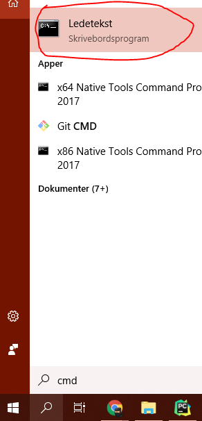
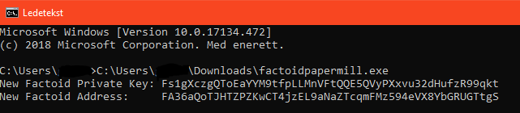

# Paper Wallet

If you are comfortable with paper wallets, you can make one using [Factoidpapermill](https://github.com/FactomProject/factoidpapermill). By using this option, you won’t be able to download a traditional printable version of the paper wallet. But this will allow you to generate private and public factoid addresses which you can write or print onto a piece of paper. FactoidPapermill is available for Windows, Mac, and Linux.

This guide also assumes you're on a secure system that you're sure is not compromised. The steps can be found in the tab below for your system of choice. 



First you need to download the file. Clicking [here ](https://github.com/FactomProject/factoidpapermill/raw/master/bin/factoidpapermill.exe)will start the download. After it's finished, browse to the location it downloaded to and let that window be open, we will use it soon.


After the download you're free to disconnect the system from the internet if you wish to do so, as the factoidpapermill doesn't require you to be online.


Next up you need to open a command prompt. Search for `CMD`at the search bar next to the windows icon at the bottom left and click the top result. As seen in the image below.



Now with the command prompt open, drag the downloaded `factoidpapermill.exe` file into the command prompt box and hit enter.



First you need to download the file. Simply run the command below.

```bash
wget https://github.com/FactomProject/factoidpapermill/raw/master/bin/factoidpapermill-linux
```


After the download you're free to disconnect the system from the internet if you wish to do so, as the factoidpapermill doesn't require you to be online. 


Now, make it executable:

```bash
sudo chmod +x ./factoidpapermill-linux
```

And simply run it:

```bash
./factoidpapermill-linux
```



After you run it you should see something similar to the images below, depending on your system. That's your private key and Factoid address.





Do **NOT** share the Factoid Private Key with anyone. If you lose this, you will most likely lose your funds stored on that address. 

However, The Factoid address is safe to share as is your public address Factoid users can send Factoids \(FCT\) to.


At this point it's up to you how you wish to get these on a piece of paper, write them manually or print them. After that's done put the paper wallet in a highly secure location such as a safe deposit box.

 If you wish to send funds to the wallet, simply send Factoids \(FCT\) to the Factoid address generated.


It is highly recommended that you send a very small amount the first time and then check the balance after some time on a Factom explorer. For example on [https://explorer.factoid.org/](https://explorer.factoid.org/) or [https://explorer.factom.com/](https://explorer.factom.com/). Paste your Factoid address to the search bar and information about your wallet should show up.


To withdraw your Factoids from your wallet you can use the Factom Enterprise Wallet. A guide on how to import the private key to the Factom Enterprise wallet and send the coins can be found on the menu bar to the left, or just click [here](https://developers.factomprotocol.org/wallets/enterprise-wallet-setup#import-private-key).

